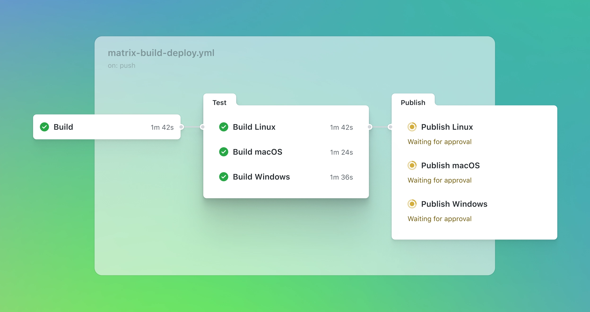
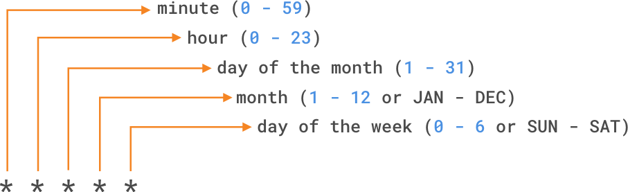

# GitHub Actions



[Actions](https://docs.github.com/en/actions)

## Essentials

GitHub Actions is a continuous integration and continuous delivery (CI/CD) platform that allows you to automate your build, test, and deployment pipeline. You can create workflows that build and test every pull request to your repository, or deploy merged pull requests to production.

GitHub provides Linux, Windows, and macOS virtual machines to run your workflows, or you can host your own self-hosted runners in your own data center or cloud infrastructure.

## Components


GitHub Actions __workflow__ could to be triggered when an __event__ occurs in your repository, such as a pull request being opened or an issue being created. Your workflow contains one or more __jobs__ which can run in sequential order or in parallel. Each job will run inside its own virtual machine __runner__, or inside a container, and has one or more __steps__ that either run a script that you define or run an action, which is a reusable extension that can simplify your workflow.

workflow:

- events
- runners
- jobs
  - steps
    - actions

### Workflow


A __workflow__ is a configurable automated process that will run one or more jobs. Workflows are defined by a YAML file checked in to your repository and will run when triggered by an event in your repository, or they can be triggered manually, or at a defined schedule.

Workflows are defined in the __.github/workflows directory__ in a repository. A repository can have multiple workflows, each of which can perform a different set of tasks such as:

- Building and testing pull requests
- Deploying your application every time a release is created
- Adding a label whenever a new issue is opened

```yaml
name: A workflow for my Hello World file
on: push
jobs:
  build:
    name: Hello world action
    runs-on: ubuntu-latest
    steps:
    - uses: actions/checkout@v1
    - uses: ./action-a
      with:
        MY_NAME: "Mona"
```

You can [reference](https://docs.github.com/en/actions/using-workflows/reusing-workflows) a workflow within another workflow.

### Events

An __event__ is a specific activity in a repository that triggers a workflow run. For example, an activity can originate from GitHub when someone creates a pull request, opens an issue, or pushes a commit to a repository. You can also trigger a workflow to run on a schedule, by posting to a REST API, or manually.

```yaml
on:
  # Trigger the workflow on push or pull request,
  # but only for the main branch
  push:
    branches:
      - main
  pull_request:
    branches:
      - main
  # Also trigger on page_build, as well as release created events
  page_build:
  release:
    types: # This configuration doesn't affect the page_build event above
      - created
```

[Events](https://docs.github.com/en/actions/using-workflows/events-that-trigger-workflows)

### Jobs

A __job__ is a set of steps in a workflow that is executed on the same runner. Each step is either a shell script that will be executed, or an action that will be run. Steps are executed in order and are dependent on each other. Since each step is executed on the same runner, you can share data from one step to another. For example, you can have a step that builds your application followed by a step that tests the application that was built.

You can configure a job's dependencies with other jobs; by default, jobs have no dependencies and run in parallel. When a job takes a dependency on another job, it waits for the dependent job to complete before running.

For example, you might configure multiple build jobs for different architectures without any job dependencies and a packaging job that depends on those builds. The build jobs run in parallel, and once they complete successfully, the packaging job runs.

```yaml
jobs:
  build:
    name: Hello world action
    runs-on: ubuntu-latest
    steps:
    - uses: actions/checkout@v1
```

[Jobs](https://docs.github.com/en/actions/using-jobs)

### Actions

An action is a custom application for the GitHub Actions platform that performs a complex but frequently repeated task. Use an action to help reduce the amount of repetitive code that you write in your workflow files. An action can pull your Git repository from GitHub, set up the correct toolchain for your build environment, or set up the authentication to your cloud provider.

You can write your own actions, or you can find actions to use in your workflows in the GitHub Marketplace.

```yaml
steps:
  - uses: actions/checkout@v1
  - name: npm install and build webpack
    run: |
      npm install
      npm run build
```

[Actions](https://docs.github.com/en/actions/creating-actions)

### Runners

A runner is a server that runs your workflows when they're triggered. Each runner can run a single job at a time. GitHub provides Ubuntu Linux, Microsoft Windows, and macOS runners to run your workflows. Each workflow run executes in a fresh, newly-provisioned virtual machine.

GitHub Actions has some usage limits, depending on your GitHub plan and whether your runner is GitHub-hosted or self-hosted.

[Runners](https://docs.github.com/en/actions/hosting-your-own-runners)

## Workflow configuration



### Cronjob

```yaml
# run a workflow every Sunday at 3:00am
on:
  schedule:
    - cron:  '0 3 * * SUN'
```

### Manual events

You can manually trigger a workflow by using the `workflow_dispatch` event. This event allows you to run the workflow by using the __GitHub REST API__ or by selecting the Run workflow button in the Actions tab within your repository on GitHub. Using `workflow_dispatch`, you can choose on which branch you want the workflow to run, as well as set optional inputs that GitHub will present as form elements in the UI.

```yaml
on:
  workflow_dispatch:
    inputs:
      logLevel:
        description: 'Log level'
        required: true
        default: 'warning'
      tags:
        description: 'Test scenario tags'
```

Webhook `repository_dispatch` allows you to trigger a workflow for activity that occurs outside of GitHub. It essentially serves as an HTTP request to your repository asking GitHub to trigger a workflow off an action or webhook. Using this manual event requires you to do two things: send a POST request to the GitHub endpoint `/repos/{owner}/{repo}/dispatches` with the __webhook event__ names in the request body, and configure your workflow to use the repository_dispatch event.

```bash
curl \
  -X POST \
  -H "Accept: application/vnd.github.v3+json" \
  https://api.github.com/repos/octocat/hello-world/dispatches \
  -d '{"event_type":"event_type"}'
```

```yaml
on:
  repository_dispatch:
    types: [opened, deleted]
```

### Webhook events

Configure a workflow to run when specific webhook events occur on GitHub. You can trigger most webhook events from more than one activity for a webhook. If multiple activities exist for a webhook, you can specify an activity type to trigger the workflow. For example, you can run a workflow for the `check_run` event, but only for the `rerequested` or `requested_action` activity types.

```yaml
on:
  check_run:
    types: [rerequested, requested_action]
```

### Conditionals

Use specific syntax `${{ <expression> }}` with `if` conditional.

```yaml
name: CI
on: push
jobs:
  prod-check:
    if: github.ref == 'refs/heads/main'
    runs-on: ubuntu-latest
    steps:
      ...

```

[Conditionals](https://docs.github.com/actions/reference/workflow-syntax-for-github-actions#jobsjob_idstepsif)

### Use action specific version

By referencing a specific version, you're placing a safeguard from unexpected changes pushed to the action that could potentially break your workflow.
For more stability and security use the commit SHA of a released action within your workflows.

```yaml
steps:
  # Reference a specific commit
  - uses: actions/setup-node@c46424eee26de4078d34105d3de3cc4992202b1e
  # Reference the major version of a release
  - uses: actions/setup-node@v1
  # Reference a minor version of a release
  - uses: actions/setup-node@v1.2
  # Reference a branch
  - uses: actions/setup-node@main
```
