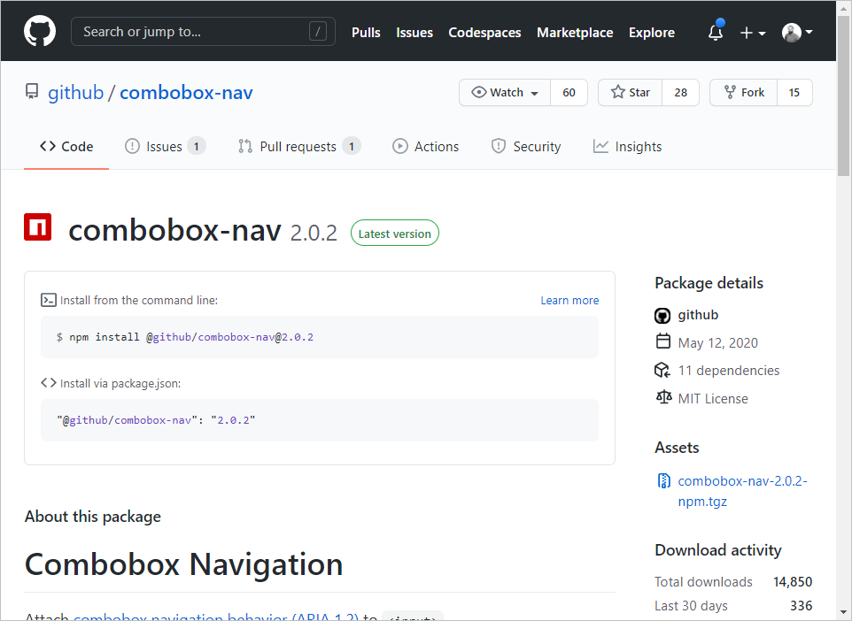

# Package Manager



[Packages](https://docs.github.com/en/packages/quickstart)

## Essentials

GitHub Packages is a package-management service that makes it easy to publish public or private packages next to your source code.
It allow you to share your project dependencies within your organization or publicly.

GitHub Packages is compatible with the following package managers:

- npm, a NodeJS package manager
- NuGet, the .NET package manager
- RubyGems, a Ruby package manager
- Maven and Gradle, two package managers for Java

GitHub Packages allow you to publish and distribute container images.

## Compare GitHub Packages to GitHub Releases

GitHub Packages are used to publish releases of your libraries to a standard package feed or a container registry. They are meant to leverage the ways the specific package-management client works with that feed, like linking back to the repository in which the package was created as well as the version of the code that was used.

GitHub Releases are used to release a bundle of packaged software, along with release notes and links to binary files. You can download those releases directly from their unique URL and track them back to the specific commit they were created from. You can only download releases as tarballs or ZIP files.

## Publish to GitHub Packages

[Publish package](https://www.neteye-blog.com/2024/09/publish-npm-package-to-github-packages-registry-with-github-actions)

```yaml
name: Node.js Package

on:
  release:
    types: [created]

jobs:
  build:
    runs-on: ubuntu-latest
    steps:
      - uses: actions/checkout@v4
      - uses: actions/setup-node@v4
        with:
          node-version: 12
      - run: npm ci
      - run: npm test

  publish-gpr:
    needs: build
    runs-on: ubuntu-latest
    steps:
      - uses: actions/checkout@v4
      - uses: actions/setup-node@v4
        with:
          node-version: 12
          registry-url: https://npm.pkg.github.com/
      - run: npm ci
      - run: npm publish
        env:
          NODE_AUTH_TOKEN: ${{secrets.GITHUB_TOKEN}}
```

## GitHub Container Registry

GitHub Container Registry allows you to configure who can manage and access packages using fine-grained permissions.

With the container registry, you can:

- Store container images within your organization and user account rather than a repository.
- Set fine-grained permissions for the container images.
- Access public container images anonymously.

```bash
echo $GITHUB_TOKEN | docker login ghcr.io -u USERNAME --password-stdin

docker tag IMAGE_ID ghcr.io/OWNER/IMAGE_NAME:latest

docker push ghcr.io/OWNER/IMAGE_NAME:latest
```
