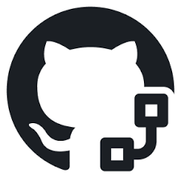

# Workflow



[Workflow](https://learn.microsoft.com/en-us/training/modules/github-actions-ci/2-github-actions-workflows-ci)

## Essentials

Notice the `on:` attribute. This workflow is triggered on a push to the repository, and when a pull request is made against the main branch.

The `runs-on:` attribute specifies that, for the operating system, the workflow runs on `ubuntu-latest`. The `node-version:` attribute specifies that there are three builds, one each for Node version 14.x, 16.x, and 18.x. We describe the matrix portion in depth later, when we customize the workflow.

The steps in the job use the GitHub Actions `actions/checkout@v3` action to get the code from your repository into the VM, and the `actions/setup-node@v3` action to set up the right version of Node.js. We specify that we're going to test three versions of Node.js with the `${{ matrix.node-version }}` attribute. This attribute references the matrix we previously defined. The cache attribute specifies a package manager for caching in the default directory.

The `npm ci` command installs dependencies from the `package-lock.json` file, `npm run build --if-present` runs a build script if it exists, and `npm test` runs the testing framework.

```yml
name: Node.js CI

on:
  push:
    branches: [ "main" ]
  pull_request:
    branches: [ "main" ]

jobs:
  build:

    runs-on: ubuntu-latest

    strategy:
      matrix:
        node-version: [16.x, 18.x]

    steps:
    - uses: actions/checkout@v3
    - name: Use Node.js ${{ matrix.node-version }}
      uses: actions/setup-node@v3
      with:
        node-version: ${{ matrix.node-version }}
        cache: 'npm'
    - run: npm ci
    - run: npm run build --if-present
    - run: npm test

  test:
    runs-on: ${{ matrix.os }}
    strategy:
      matrix:
        os: [ubuntu-latest, windows-latest]
        node-version: [16.x, 18.x]
    steps:
    - uses: actions/checkout@v3
    - name: Use Node.js ${{ matrix.node-version }}
      uses: actions/setup-node@v3
      with:
        node-version: ${{ matrix.node-version }}
    - name: npm install, and test
      run: |
        npm install
        npm test
      env:
        CI: true

```

## Customization

Configure [build matrix](https://docs.github.com/enterprise-server@3.14/actions/writing-workflows/about-workflows#using-a-build-matrix) for testing across multiple operating systems and language versions. This matrix produces four builds, one for each operating system paired with each version of Node.

```yml
test:
  runs-on: ${{ matrix.os }}
  strategy:
    matrix:
      os: [ubuntu-latest, windows-latest]
      node-version: [16.x, 18.x]
  steps:
  - uses: actions/checkout@v3
  - name: Use Node.js ${{ matrix.node-version }}
    uses: actions/setup-node@v3
    with:
      node-version: ${{ matrix.node-version }}
  - name: npm install, and test
    run: |
      npm install
      npm test
    env:
      CI: true
```

### Artifacts

Artifacts - products other than a log entry, can be uploaded to storage by using the action `actions/upload-artifact` and later downloaded from storage by using the action `actions/download-artifact`.

Storing an artifact preserves it between jobs. Each job uses a fresh instance of a virtual machine (VM), so you can't reuse the artifact by saving it on the VM. If you need your artifact in a different job, you can upload the artifact to storage in one job, and download it for the other job.

```yml
test:
  runs-on: ${{ matrix.os }}
  strategy:
    matrix:
      os: [ubuntu-latest, windows-latest]
      node-version: [16.x, 18.x]
  steps:
  - uses: actions/checkout@v3
  - name: Use Node.js ${{ matrix.node-version }}
    uses: actions/setup-node@v3
    with:
      node-version: ${{ matrix.node-version }}
  - name: npm install, and test
    run: |
      npm install
      npm test
    env:
      CI: true
```

Artifacts are stored in storage space on GitHub. The space is free for public repositories and some amount is free for private repositories, depending on the account. GitHub stores your artifacts for 90 days.

```yml
build:
    runs-on: ubuntu-latest
    steps:
      - uses: actions/checkout@v3
      - name: npm install and build webpack
        run: |
          npm install
          npm run build
      - uses: actions/upload-artifact@main
        with:
          name: webpack artifacts
          path: public/
```

To download the artifact for testing, the build must complete successfully and upload the artifact. In the following code, we specify that the test job depends on the build job.

```yml
test:
    needs: build
    runs-on: ubuntu-latest
```

```yml
steps:
    - uses: actions/checkout@v3
    - uses: actions/download-artifact@main
      with:
        name: webpack artifacts
        path: public
```

### Reviews

Run the workflow only after a person performs an action. For example, we might only want to run a workflow after a reviewer approves the pull request. For this scenario, we can trigger on `pull-request-review`.

```yml
steps:
     - name: Label when approved
       uses: pullreminders/label-when-approved-action@main
       env:
         APPROVALS: "1"
         GITHUB_TOKEN: ${{ secrets.GITHUB_TOKEN }}
         ADD_LABEL: "approved"
```

## Environment variables and artifact data

### Custom environment variables

```yml
name: CI
on: push
jobs:
  prod-check:
    if: github.ref == 'refs/heads/main'
    runs-on: ubuntu-latest
    steps:
      - run: echo "Nice work, $First_Name. Deploying to production server on branch $GITHUB_REF"
        env:
          First_Name: Mona
```

### Scripts

```yml
jobs:
  npm:
    steps:
      - run: npm install -g bats

  script:
    steps:
      - name: Run build script
        run: ./.github/scripts/build.sh
        shell: bash

```

### Cache dependencies

Caching dependencies will help speed up the time it takes to recreate these dependency files.

```yml
steps:
  - uses: actions/checkout@v2

  - name: Cache NPM dependencies
    uses: actions/cache@v2
    with:
      path: ~/.npm
      key: ${{ runner.os }}-npm-cache-${{ hashFiles('**/package-lock.json') }}
      restore-keys: |
        ${{ runner.os }}-npm-cache-
```

the path is set to `~/.npm` and the key includes the runner's operating system and the SHA-256 hash of the `package-lock.json` file. Prefixing the key with an ID (`npm-cache` in this example) is useful when you're using the restore-keys fallback and have multiple caches.

### Pass artifact data between jobs

```yml
name: Share data between jobs
on: push
jobs:
  job_1:
    name: Upload File
    runs-on: ubuntu-latest
    steps:
      - run: echo "Hello World" > file.txt
      - uses: actions/upload-artifact@v2
        with:
          name: file
          path: file.txt

  job_2:
    name: Download File
    runs-on: ubuntu-latest
    needs: job_1
    steps:
      - uses: actions/download-artifact@v2
        with:
          name: file
      - run: cat file.txt
```

### Debugging

Enable diagnostic logging by setting two repository secrets that require admin access to the repository to `true`:

- To enable __runner diagnostic__ logging, set the `ACTIONS_RUNNER_DEBUG` secret in the repository that contains the workflow to `true`.
- To enable __step diagnostic__ logging, set the `ACTIONS_STEP_DEBUG` secret in the repository that contains the workflow to `true`.

### Workflow logs

Use GitHub's REST API to view logs for workflow runs, re-run workflows, or even cancel workflow runs.

```http
GET /repos/{owner}/{repo}/actions/runs/{run_id}/logs
```
