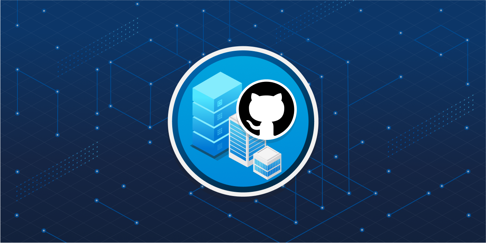
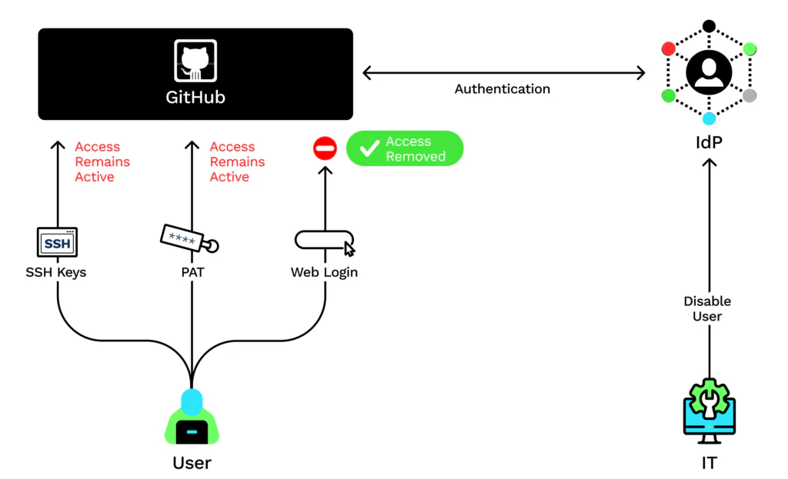

# Administration

[Branch protection](https://docs.github.com/en/repositories/configuring-branches-and-merges-in-your-repository/managing-protected-branches/managing-a-branch-protection-rule)

In GitHub, each user is an organization member that you can add to a team. You can create teams in your organization with cascading access permissions and mentions reflecting your company or group's structure.

## Team-level administration

Best practices:

- create nested teams to reflect your group or company's hierarchy.
- help streamline PR review processes by creating teams based on interests or specific technology (JavaScript, data science, etc.).
- enable team synchronization between your IdP and GitHub to allow organization owners and team maintainers to connect teams in your organization with IdP groups. When you synchronize a GitHub team with an IdP group, you can replicate changes to GitHub automatically, reducing the need for manual updates and custom scripts. You can use an IdP with team synchronization to manage administrative tasks such as onboarding new members, granting new permissions, and removing member access to the organization.

## Organization level

Organizations are shared spaces enabling users to collaborate across many projects at once.
Set up only one organization for your users and repositories - deduplication and clean mgmt.

Owner permission permissions:

- invite users to join the organization, and remove members from the organization.
- organize users into a team, and grant team maintainer permissions to organization members.
- add or remove outside collaborators (people who aren't explicitly members of your  organization, such as consultants or temporary employees) to organizational repositories.
- grant repository permission levels to members, and set the base (default) permission level for a given repository.
- set up organization security.
- set up billing or assign a billing manager for the organization.
- extract various types of information about repositories via the use of custom scripts.
- apply organization-wide changes such as migrations via the use of custom scripts.

## Enterprise level

Enterprise accounts include GitHub Enterprise Cloud and Enterprise Server instances and enable owners to centrally manage policy and billing for multiple organizations.

Enterprise level permissions:

- enable security assertion markup language (SAML) single sign-on for their enterprise account, allowing each enterprise member to link their external identity on your IdP to their existing GitHub account.
- add or remove organizations from the enterprise.
- set up billing or assign a billing manager for all organizations in the enterprise.
- set up repository management policies, project board policies, team policies, and other security settings that apply to all the organizations, repositories, and members in the enterprise.
- extract various types of information about organizations via the use of custom scripts.
- apply enterprise-wide changes such as migrations via the use of custom scripts.

## Authentication options

- Username and password.  "basic" HTTP authentication scheme - risky.
- Personal access tokens (PAT). API or the command line option. Users generate a token via the GitHub's settings option, and tie the token permissions to a repository or organization.
- SSH keys. Generate an SSH key, add it to the ssh-agent, and then add the key to their GitHub account. You can even use SSH keys with a repository owned by an organization that uses SAML single sign-on (SSO). If the organization provides SSH certificates, users can also use it to access the organization's repositories without adding the certificate to their GitHub account.
- Deploy keys. Grants a user access to a single repository. ploy keys are read-only by default, but you can give them write access when adding them to a repository.
- Two-factor authentication (2FA). Organization owners can require organization members, outside collaborators, and billing managers to enable 2FA for their personal accounts. This action makes it harder for malicious actors to access an organization's repositories and settings.
- SAML SSO. Log in via organization's SAML IdP for authentication. GitHub offers limited support for all identity providers that implement the SAML 2.0 standard with official support for several popular identity providers including:
  - Active Directory Federation Services (AD FS)
  - Microsoft Entra ID
  - Okta
  - OneLogin
  - PingOne
- Lightweight directory access protocol (LDAP).  LDAP lets you authenticate GitHub Enterprise Server against your existing accounts and centrally manage repository access. It's one of the most common protocols used to integrate third-party software with large company user directories.
GitHub Enterprise Server integrates with popular LDAP services like:
  - Active Directory
  - Oracle Directory Server Enterprise Edition
  - OpenLDAP
  - Open Directory

## Permissions

### Repository permission levels

Repository-level permissions:

- Read: Recommended for non-code contributors who want to view or discuss your project. This level is good for anyone that needs to view the content within the repository but doesn't need to actually make contributions or changes.
- Triage: Recommended for contributors who need to proactively manage issues and pull requests without write access. This level could be good for some project managers who manage tracking issues but don't make any changes.
- Write: Recommended for contributors who actively push to your project. Write is the standard permission for most developers.
- Maintain: Recommended for project managers who need to manage the repository without access to sensitive or destructive actions.
- Admin: Recommended for people who need full access to the project, including sensitive and destructive actions like managing security or deleting a repository. These people are repository owners and administrators.

### Team permission levels

Teams provide an easy way to assign repository permissions to several related users at once. Members of a child team also inherit the permission settings of the parent team, providing an easy way to cascade permissions based on the natural structure of a company.

| __Permission level__ | __Description__
| -------    | ------------------
| Member     | Team members have the same set of abilities as organization members
| Maintainer | Team maintainers can do everything team members can, plus:
|            | - Change the team's name, description, and visibility.
|            | - Request that the team change parent and child teams.
|            | - Set the team profile picture.
|            | - Edit and delete team discussions.
|            | - Add and remove organization members from the team.
|            | - Promote team members to also have the team maintainer permission.
|            | - Remove the team's access to repositories.
|            | - Manage code review assignment for the team.
|            | - Manage scheduled reminders for pull requests.

### Organization permission levels

| __Permission level__ | __Description__
| -------    | ------------------
| Owner             | Organization owners can do everything that organization members can do, and they can add or remove other users to and from the organization. This role should be limited to no less than two people in your organization.
| Member            | Organization members can create and manage organization repositories and teams.
| Moderator         | Organization moderators can block and unblock nonmember contributors, set interaction limits, and hide comments in public repositories that the organization owns.
| Billing manager   | Organization billing managers can view and edit billing information.
| Security managers | Organization security managers can manage security alerts and settings across your organization. They can also read permissions for all repositories in the organization.
| Outside collaborator | Outside collaborators, such as a consultant or temporary employee, can access one or more organization repositories. They aren't explicit members of the organization.

### Enterprise permission levels

| __Permission level__ | __Description__
| -------    | ------------------
| Owner | Enterprise owners have complete control over the enterprise and can take every action, including:
|       | - Managing administrators.
|       | - Adding and removing organizations to and from the enterprise.
|       | - Managing enterprise settings.
|       | - Enforcing policies across organizations.
|       | - Managing billing settings.
| Member | Enterprise members have the same set of abilities as organization members.
| Billing manager | Enterprise billing managers can only view and edit your enterprise's billing information and add or remove other billing managers.

### Repository security and management

- Protection rules that can be applied to a branch include:
  - require a pull request before merging.
  - require status checks to pass before merging.
  - require conversation resolution before merging.
  - require signed commits.
  - require linear history.
  - require merge queue.
  - require deployments to succeed before merging.
  - lock the branch by making it read-only.
  - restrict who can push to matching branches.
- Add a CODEOWNERS file
- view traffic by using Insights

## SAML SSO & SCIM

SAML single sign-on (SSO) gives organization owners and enterprise owners on GitHub a way to control and secure access to organization resources like repositories, issues, and pull requests. If you use SAML SSO in your organization, you can implement SCIM or System for Cross-domain Identity Management. SCIM lets you add, manage, or remove organization member access within GitHub. SCIM was developed to allow synchronization of information between an IdP and multiple applications.

SCIM is a protocol that tells the directory an account has been created and allows you to automate the exchange of user identity information between systems. For example, while onboarding a new employee, using a central directory allows you to automatically provision the user to access services like GitHub. An administrator can deprovision an organization member using SCIM and automatically remove the member from the organization.

