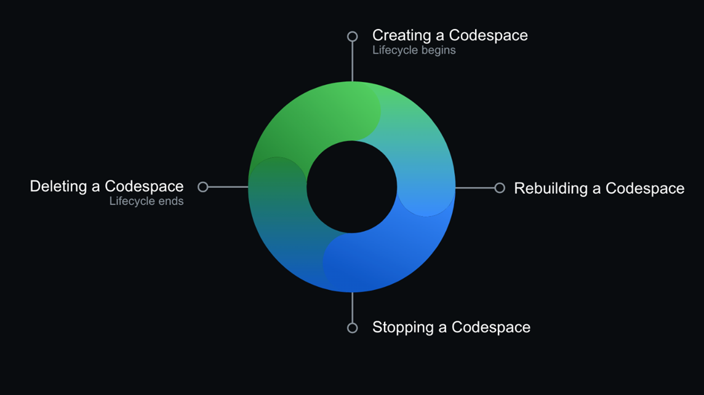

# Codespace

## Codespace essentials

GitHub Codespaces is configurable, allowing you to create a customized development environment for your project. By configuring a custom development environment for your project, you can have a repeatable Codespace configuration for all users of your project.

A Codespace's lifecycle begins when you create a Codespace and ends when you delete it. You can disconnect and reconnect to an active Codespace without affecting its running processes. You can stop and restart a Codespace without losing the changes that you make to your project.

## Codespace workflow

You can open `https://github.com/codespaces` in the browser, select the repository, and then select the existing Codespace.

## Codespaces versus GitHub.dev editor

You can use GitHub.dev to navigate files and sources code repositories from GitHub, and make and commit code changes. You can open any repository, fork, or pull request in GitHub.dev editor.

If you want to do more heavy lifting like testing your code, use GitHub Codespaces. It has compute associated with it so you can build your code, run your code, and have terminal access. GitHub.dev doesn't have compute in it. With GitHub Codespaces, you get the power of a personal Virtual Machine (VM) with terminal access, the same way you could use your local environment, just in the cloud.
