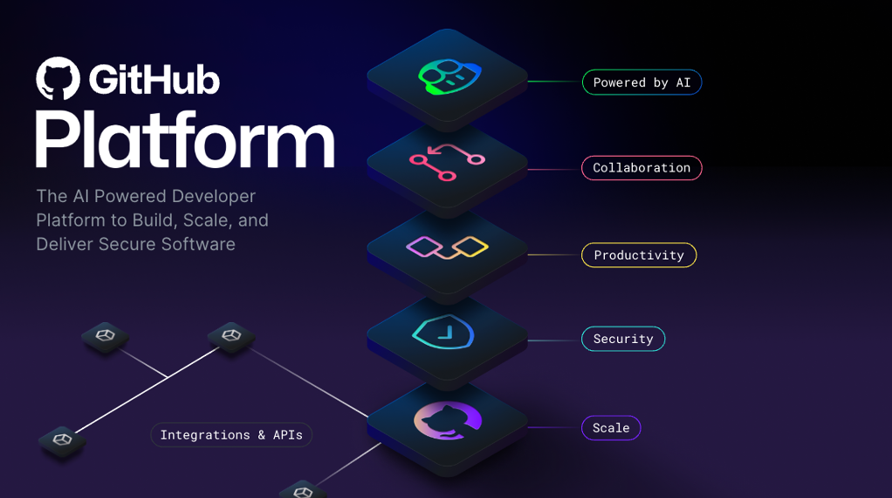

# Github

## Github essentials

GitHub is a cloud-based platform that uses Git, a distributed version control system, at its core. The GitHub platform simplifies the process of collaborating on projects and provides a website, command-line tools, and overall flow that allows developers and users to work together.

### AI

Generative AI is dramatically transforming software development as we speak. The GitHub Enterprise platform is enhancing collaboration through AI-powered pull requests and issues, productivity through Copilot, and security by automating security checks faster.

### Collaboration

Repositories, Issues, Pull Requests, and other tools help to enable developers, project managers, operation leaders, and others at the same company. It enables them to work faster together, cut down approval times, and ship more quickly.

### Productivity

Productivity is accelerated with automation that the GitHub Enterprise Platform provides. With built-in CI/CD (Continuous Integration and Continuous Delivery) tools directly integrated into the workflow, the platform gives users the ability to set tasks and forget them, taking care of routine administration and speeding up day-to-day work.

### Security

GitHub Enterprise platform includes native, first-party security features that minimize security risk with a built-in security solution. Plus, your code remains private within your organization. At the same time, you're able to take advantage of security overview and Dependabot.

### Scale

GitHub is the largest developer community of its kind with real-time data on over 100M+ developers, 330M+ repositories, and countless deployments.

In essence, the GitHub Enterprise Platform focuses on the developer experience. It has the scale to provide industry-changing insights, collaboration capabilities for transformative efficiency, the tools for increased productivity, security at every step, and AI to power it all to new heights in a single, integrated platform.

### Gist

Gists are a simplified way to share code snippets with others.
Every gist is a Git repository, which you can fork and clone and be made either public or secret. Public gists are displayed publicly where people can browse new ones as they’re created. Public gists are also searchable. Conversely, secret gists aren't searchable, but they aren’t entirely private.

### Wiki

Section for hosting documentation. Used to share long-form content about your project, such as how to use it, how you designed it, or its core principles. While a README file quickly tells what your project can do, you can use a wiki to provide additional documentation.

## Github flow

1. Start by creating a branch so that the changes, features, and fixes you create don't affect the main branch.
2. Make your changes. We recommend deploying changes to your feature branch before merging into the main branch.
3. Create a pull request to ask collaborators for feedback. Some repositories require an approving review before pull requests can be merged.
4. Review and implement your feedback from your collaborators.
5. Approve pull request and merge it into the main branch.
6. Delete feature branch.
